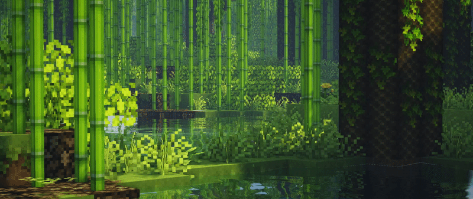

[
 
Background GIF by [wolf](https://www.pinterest.com/pin/735916395364760362/) on [Pinterest](https://www.pinterest.com/).

 &nbsp;

# About Me:
Hi, I'm Oliver.  - I'm a Software Engineering student with a passion for programming, problem-solving, and continuous learning.   - I have a strong foundation in Python, HTML/CSS, React, SQL, Java — with experience in both solo and group-based projects. 

## 💡 A Quote:

